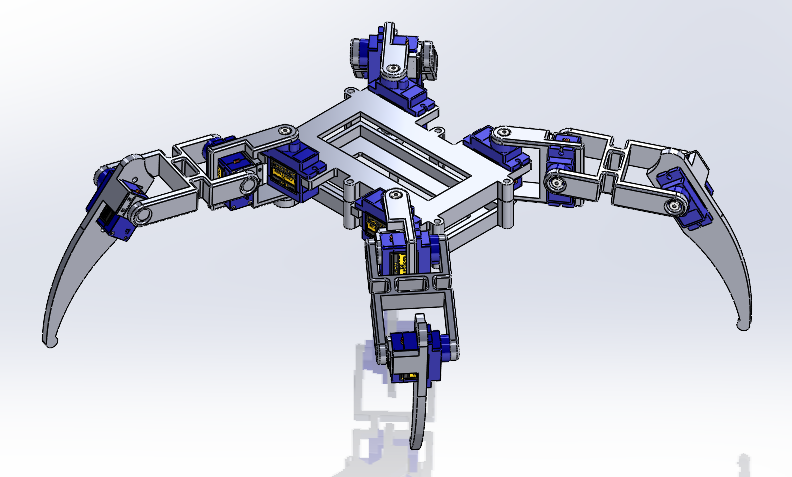
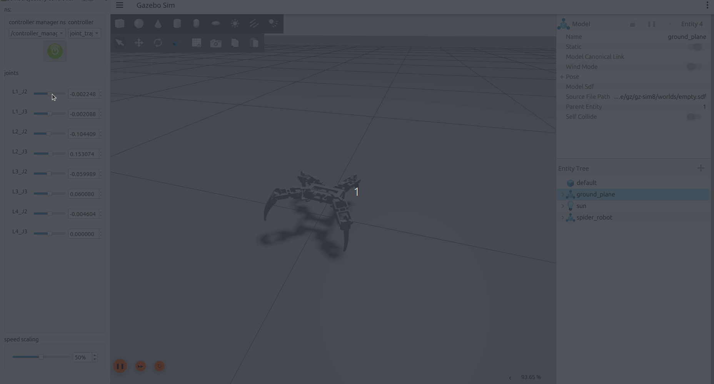
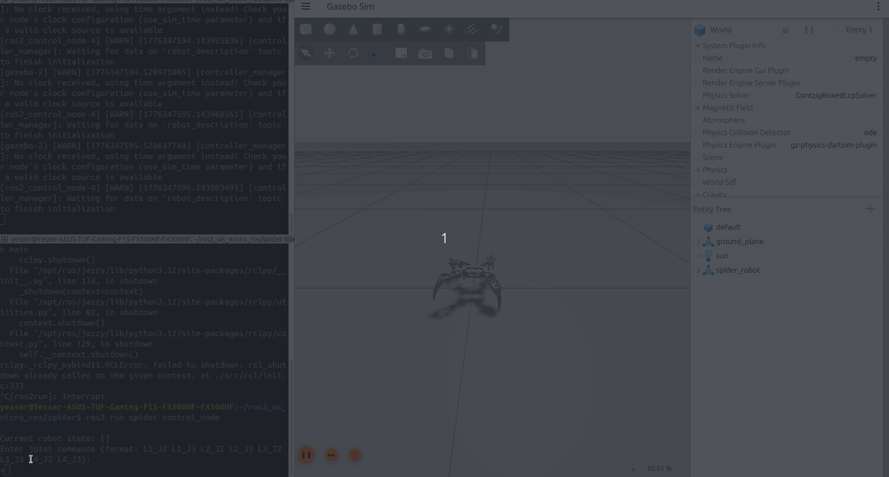

# Spider Robot ROS 2 Control & RL Simulation


This repository tracks the development of a quadruped spider robot simulation built with **ROS 2 Jazzy** and **Gazebo Harmonic**. The project focuses on bridging the gap between mechanical design (SolidWorks) and intelligent locomotion using Reinforcement Learning, documented step-by-step.

## Development Journey

### Step 1: Mechanical Export (SolidWorks to URDF)
The project began by designing the robot in SolidWorks. To ensure realistic physics in Gazebo, I used the SW2URDF exporter plugin to carefully capture the exact mass, collision boundaries, and inertias (including realistic metrics for SG90 servos). 

<p align="center">
  
</p>

* *Resource:* I followed this 3-part YouTube tutorial series ([Part 1](https://www.youtube.com/watch?v=Id8zVHrQSlE), [Part 2](https://www.youtube.com/watch?v=SDr6ru8R0qc), [Part 3](https://www.youtube.com/watch?v=wxxRuM_qZtE&t=777s)) for the exportation process.

### Step 2: ROS 2 Control & GUI Validation
Once the URDF was in Gazebo, I configured a hardware abstraction layer using `gz_ros2_control`. I set up the `joint_state_broadcaster` and a `joint_trajectory_controller` for 8-DOF position control. I initially tested the kinematics and URDF limits using the `rqt_joint_trajectory_controller` GUI to ensure the spider could move.



### Step 3: Validating the Action/Observation Pipeline (Current State)
To prepare for Reinforcement Learning, I needed to guarantee that Python could communicate flawlessly with Gazebo. I built an initial prototype control node (`control.py`) to serve as a stand-in for the future RL agent:
* **Simulating Observations:** It subscribes to `/joint_states` to read the robot's current position.
* **Simulating Actions:** Instead of an RL policy, it takes manual terminal inputs, formats them with zero-velocities and accurate time stamps, and publishes them to the trajectory controller.
* **Result:** The two-way communication bridge is 100% verified. In the upcoming phase, the manual terminal input in `control.py` will be replaced by a Gymnasium-compatible wrapper and a neural network policy.



### Step 4: Reinforcement Learning Environment (Gymnasium Wrapper)
To train the RL agent, I created a custom Gymnasium environment (`spider_env.py`) by following the official [Create a Custom Environment](https://gymnasium.farama.org/introduction/create_custom_env/) documentation. The instructions outline four essential steps to build a compliant environment. 

In our case, we applied these 4 steps using ROS 2 nodes and Gazebo physics:

1. **Initialize Environment (`def __init__(self)`):** We define the action and observation limits here. We also set up our **Bridge Architecture**: a ROS 2 node runs on a separate background thread to continuously read sensor data (`/joint_states` and `/imu`) without blocking the RL algorithm's dictatorial control loop.
2. **Constructing Observations (`def _get_obs(self)`):** The environment gathers 14 variables (12 joint angles + Pitch & Roll). Gazebo outputs Quaternions to avoid Gimbal lock, so I implemented standard 3D spatial math to convert them into Euler angles for the agent's observation array.
3. **Create a Reset Function (`def reset(self, seed=None, options=None)`):** This function utilizes Python's `subprocess` to trigger Gazebo's `/world/empty/set_pose` service, instantly teleporting the robot back to the center and resetting its limbs to a default standing pose after a fall.
4. **Create a Step Function (`def step(self, action)`):** The `step()` function applies the agent's joint commands, waits for the physics to update, and calculates the survival rewards.

> **Important Note:** Even though we wrote the custom logic ourselves, we must name the functions exactly as the API dictates (`step`, `reset`, etc.) so that the Stable Baselines3 PPO algorithm can recognize and interact with our environment.

**RL Virtual Environment Setup:**
On modern Ubuntu systems, we must use a virtual environment to install new Python packages (like Gymnasium and Stable Baselines3) so we don't interfere with or break the system-wide Python files.
```bash
# Create and activate the virtual environment
cd ~/ros2_ws
python3 -m venv --system-site-packages rl_env
source rl_env/bin/activate

# Install RL libraries
pip install gymnasium stable-baselines3[extra]
## You can't run normal colcon build , you have to use :
python -m colcon build
```

## Tech Stack
* **Middleware:** ROS 2 Jazzy Jalisco
* **Simulator:** Gazebo Harmonic (GZ Sim)
* **Language:** Python / C++
* **Tools:** SolidWorks, URDF, RQT

## Project Structure
* `urdf/`: Contains the robot description and physical properties.
* `config/`: YAML files defining the controller parameters and update rates.
* `launch/`: Python scripts to orchestrate the simulation, spawners, and state publishers.
* `meshes/`: STL/DAE files for visual and collision representation.
* `spider/`: Contains the custom Python nodes (`control.py`, `spider_env.py`).

## Installation & Usage
1. **Clone the repo:**
   ```bash
   cd ~/ros2_ws/src
   git clone git@github.com:yesserhmidi3/spider-robot-ros2-rl.git
   ```
2. **Install Dependencies:**
   ```bash
   sudo apt install ros-jazzy-ros2-control ros-jazzy-ros2-controllers ros-jazzy-gz-ros2-control
   ```
3. **Build & Launch:**
   ```bash
   colcon build --packages-select spider
   source install/setup.bash
   ros2 launch spider launch.py
   ```
4. **Run Terminal Control Node (In a new terminal):**
   ```bash
   source install/setup.bash
   ros2 run spider control_node
   ```

## Roadmap & Next Steps
With the "Laboratory" (Gymnasium wrapper) fully built and verified, the project moves into the RL training phase:
1. **✅ Phase 1: Environment Wrapping**
   Created a Gymnasium-compatible wrapper bridging Gazebo physics with Python RL libraries.
   
3. **Phase 2: Proximal Policy Optimization (PPO)**
    Implement the **train.py** script using Stable Baselines3 to train a PPO agent.
   
5. **Phase 3: Locomotion (Gait Generation)**
    Refine the reward functions based on forward velocity, body orientation, and energy efficiency to teach the spider an autonomous walking gait.


