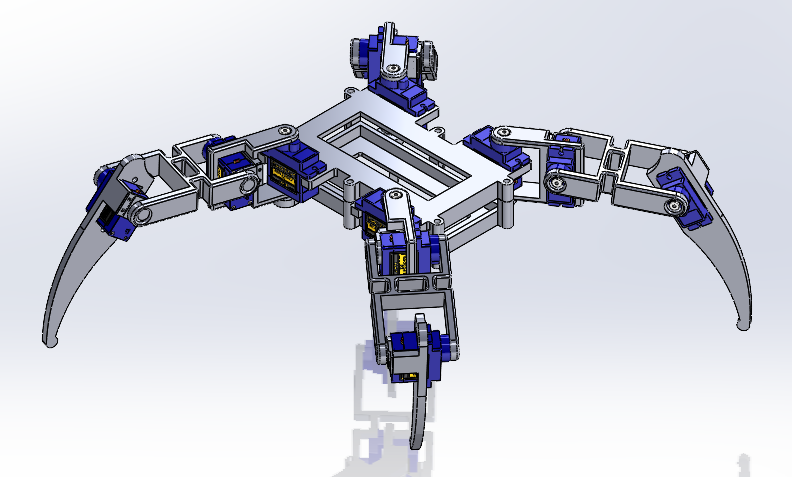
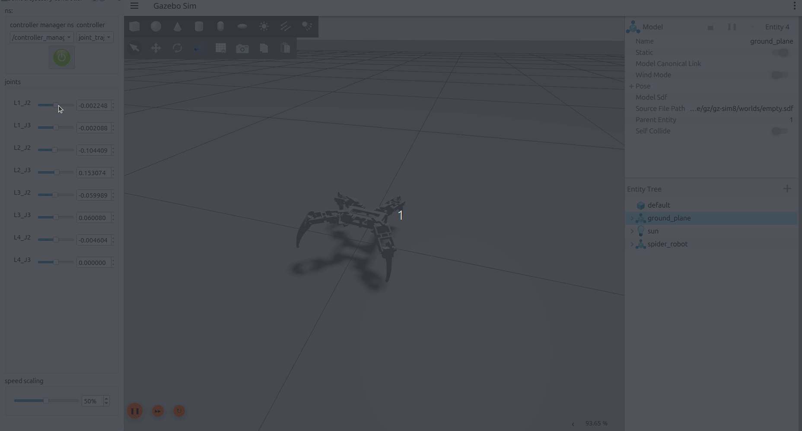
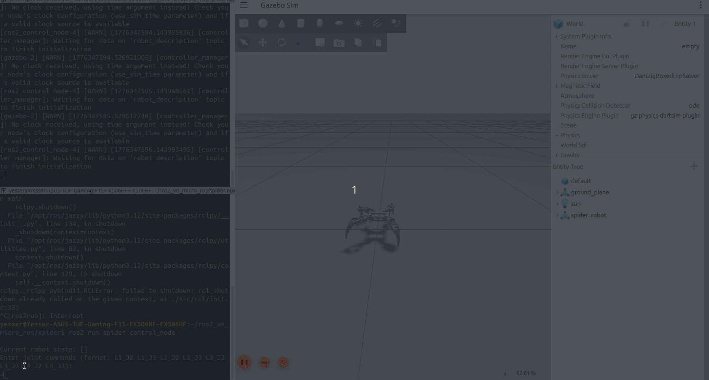
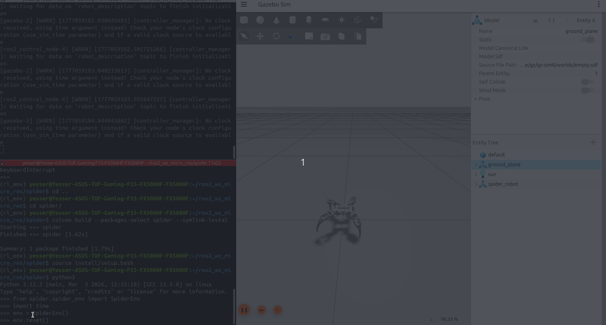
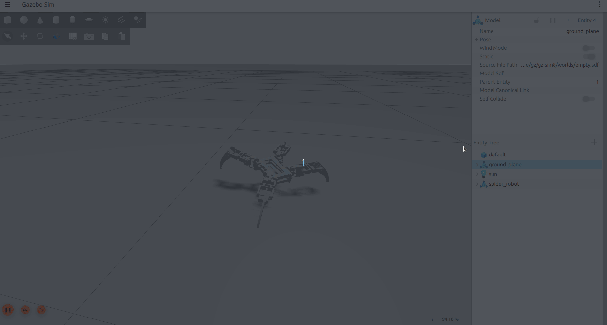
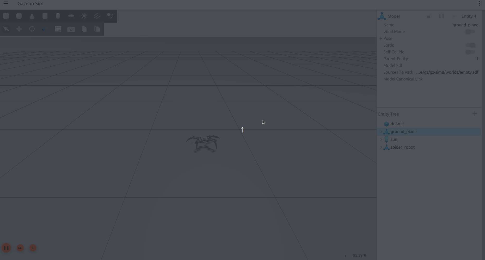
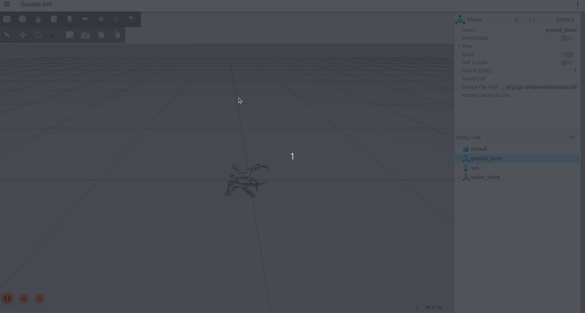
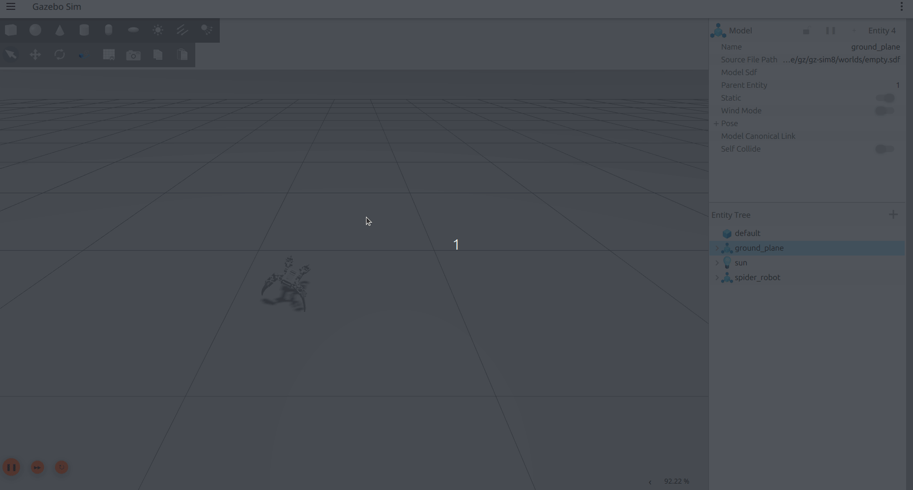
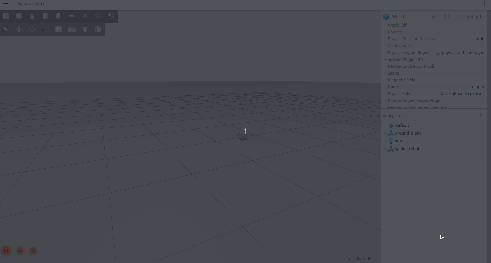

# Spider Robot ROS 2 Control & RL Simulation


This repository tracks the development of a quadruped spider robot simulation built with **ROS 2 Jazzy** and **Gazebo Harmonic**. The project focuses on bridging the gap between mechanical design (SolidWorks) and intelligent locomotion using Reinforcement Learning, documented step-by-step.

## Development Journey

### Step 1: Mechanical Export (SolidWorks to URDF)
The project began by designing the robot in SolidWorks. To ensure realistic physics in Gazebo, I used the SW2URDF exporter plugin to carefully capture the exact mass, collision boundaries, and inertias (including realistic metrics for SG90 servos). 

<p align="center">
  
</p>

* *Resource:* I followed this 3-part YouTube tutorial series ([Part 1](https://www.youtube.com/watch?v=Id8zVHrQSlE), [Part 2](https://www.youtube.com/watch?v=SDr6ru8R0qc), [Part 3](https://www.youtube.com/watch?v=wxxRuM_qZtE&t=777s)) for the exportation process.

### Step 2: ROS 2 Control & GUI Validation
Once the URDF was in Gazebo, I configured a hardware abstraction layer using `gz_ros2_control`. I set up the `joint_state_broadcaster` and a `joint_trajectory_controller` for 8-DOF position control. I initially tested the kinematics and URDF limits using the `rqt_joint_trajectory_controller` GUI to ensure the spider could move.



### Step 3: Validating the Action/Observation Pipeline
To prepare for Reinforcement Learning, I needed to guarantee that Python could communicate flawlessly with Gazebo. I built an initial prototype control node (`control.py`) to serve as a stand-in for the future RL agent:
* **Simulating Observations:** It subscribes to `/joint_states` to read the robot's current position.
* **Simulating Actions:** Instead of an RL policy, it takes manual terminal inputs, formats them with zero-velocities and accurate time stamps, and publishes them to the trajectory controller.
* **Result:** The two-way communication bridge is 100% verified. In the upcoming phase, the manual terminal input in `control.py` will be replaced by a Gymnasium-compatible wrapper and a neural network policy.



### Step 4: Reinforcement Learning Environment (Gymnasium Wrapper)
To train the RL agent, I created a custom Gymnasium environment (`spider_env.py`) by following the official [Create a Custom Environment](https://gymnasium.farama.org/introduction/create_custom_env/) documentation. The instructions outline four essential steps to build a compliant environment. 

In our case, we applied these 4 steps using ROS 2 nodes and Gazebo physics:

1. **Initialize Environment (`def __init__(self)`):** We define the action and observation limits here. We also set up our **Bridge Architecture**: a ROS 2 node runs on a separate background thread to continuously read sensor data (`/joint_states` and `/imu`) without blocking the RL algorithm's dictatorial control loop.
2. **Constructing Observations (`def _get_obs(self)`):** The environment gathers 14 variables (12 joint angles + Pitch & Roll). Crucially, we exclude the absolute X-coordinate from the agent's "vision" to ensure it learns a universal walking gait rather than memorizing its position in the world. I implemented standard 3D spatial math to convert Gazebo's Quaternions into Euler angles for the observation array.
3. **Create a Reset Function (`def reset(self, seed=None, options=None)`):** This function utilizes Python's `subprocess` to trigger Gazebo's `/world/empty/set_pose` service, instantly teleporting the robot back to the center and resetting its limbs to a default standing pose after a fall.
4. **Create a Step Function (`def step(self, action)`):** The `step()` function applies the agent's joint commands, waits for the physics to update, and calculates the survival rewards.

**Testing the Wrapper:**
To verify that the environment wrapping works correctly, I manually triggered the `reset()` function from a Python shell. As shown below, the robot successfully teleports back to the origin and snaps into its default standing pose, proving the ROS 2 / Gymnasium bridge is fully operational.



> **Important Note:** Even though we wrote the custom logic ourselves, we must name the functions exactly as the API dictates (`step`, `reset`, etc.) so that the Stable Baselines3 PPO algorithm can recognize and interact with our environment.

### Step 5: Training the PPO Agent & Reward Shaping (Phase 2)

With the environment ready, I implemented the training pipeline using Stable Baselines3.

#### 1. Reward Shaping
Initially, I used a simple reward function: `base_reward = 1.0 + (forward_velocity * 10.0)`. However, the RL agent quickly found a loophole: it would simply stand perfectly still to endlessly farm the `1.0` survival reward, and when it did walk, it dragged its belly on the floor.I also nerfed the energy penalty so it’s not scared to move, which helped encourage more active and natural locomotion.

To fix this, I nerfed the survival reward, heavily buffed the forward velocity multiplier, and added a strict penalty if the robot's Z-height dropped too low. Here is the updated `step()` function inside `spider_env.py`:

```python
    def step(self, action):
        # 1. Send the RL's chosen action to Gazebo
        self.node.send_action(action)
        time.sleep(0.1) 
        
        # 2. Read new states & calculate velocity
        obs = self._get_obs()
        current_x = self.node.current_x
        forward_velocity = (current_x - self.previous_x) / 0.1 
        self.previous_x = current_x
        
        # 3. Fall Detection
        terminated = False
        if abs(self.node.current_pitch) > 0.8 or abs(self.node.current_roll) > 0.8: 
            terminated = True
            
        # 4. Calculate Rewards
        if terminated:
            reward = -10.0 # Harsh penalty for falling
        else:
            base_reward = 0.1 + (forward_velocity * 50.0) 
            
            # Penalties
            stability_penalty = (abs(self.node.current_pitch) + abs(self.node.current_roll)) * 0.05
            energy_penalty = sum([abs(a) for a in action]) * 0.01
            height_penalty = 1.0 if self.node.current_z < 0.03 else 0.0
            
            reward = base_reward - stability_penalty - energy_penalty - height_penalty

        # 5. Episode limit
        self.current_step += 1
        truncated = True if self.current_step >= self.max_steps else False

        return obs, reward, terminated, truncated, {}
```

#### 2. The Training Script (`train.py`)
To train efficiently, I created `train.py`. It utilizes a `CheckpointCallback` to save a backup brain every 10,000 steps (preventing catastrophic forgetting). Note that I set `device="cpu"`, as CPU processing proved faster for this specific MLP setup.

> ** Pro-Tip for Training:** Always run Gazebo in **Headless Mode** when training! In your `launch.py`, change the argument to `launch_arguments={'gz_args': '-r -s empty.sdf'}.items()`. The `-s` runs the server without the 3D GUI, freeing up massive amounts of CPU/GPU power.

```python
import os
from stable_baselines3 import PPO
from stable_baselines3.common.callbacks import CheckpointCallback 
from spider_env import SpiderEnv 

def train():
    env = SpiderEnv()
    MODEL_PATH = "spider_ppo_model_latest.zip"
    
    if os.path.exists(MODEL_PATH):
        print(f"--- SAVED MODEL FOUND! Loading {MODEL_PATH}... ---")
        model = PPO.load(MODEL_PATH, env=env, tensorboard_log="./ppo_spider_logs/", device="cpu") 
    else:
        print("--- NO SAVED MODEL FOUND. Starting a new brain from scratch... ---")
        model = PPO("MlpPolicy", env, verbose=1, learning_rate=0.0003, tensorboard_log="./ppo_spider_logs/", device="cpu")

    checkpoint_callback = CheckpointCallback(save_freq=10000, save_path='./models/', name_prefix='spider_brain')
    TIMESTEPS = 100000
    
    print(f"--- STARTING OVERNIGHT RUN FOR {TIMESTEPS} STEPS ---")
    try:
        model.learn(total_timesteps=TIMESTEPS, reset_num_timesteps=False, callback=checkpoint_callback) 
    except KeyboardInterrupt:
        print("\n--- TRAINING INTERRUPTED BY USER! SAVING PROGRESS... ---")
    finally:
        model.save("spider_ppo_model_latest")
        env.close()

if __name__ == '__main__':
    train()
```

#### 3. The Testing Script (`test.py`)
To watch the robot in action, I use `test.py`. It explicitly sets `deterministic=True` so the AI relies purely on its learned policy rather than guessing randomly. 

```python
import time
from stable_baselines3 import PPO
from spider_env import SpiderEnv

def test():
    env = SpiderEnv()
    
    # Load a specific successful checkpoint
    MODEL_PATH = "models/spider_brain_677761_steps.zip"
    model = PPO.load(MODEL_PATH)
    
    obs, info = env.reset()
    print("--- STARTING TEST RUN ---")

    try:
        while True:
            # deterministic=True is CRITICAL for evaluating actual learned behavior
            action, _states = model.predict(obs, deterministic=True)
            obs, reward, terminated, truncated, info = env.step(action)
            
            if terminated or truncated:
                obs, info = env.reset()
                
    except KeyboardInterrupt:
        print("\n--- TEST STOPPED ---")
    finally:
        env.close()

if __name__ == '__main__':
    test()
```

#### 4. Training Progression & Current Best Results

<table align="center">
  <tr>
    <td align="center"><b>Phase 1</b><br></td>
    <td align="center"><b>Phase 2</b><br></td>
  </tr>
  <tr>
    <td align="center"><b>Phase 3</b><br></td>
    <td align="center"><b>Phase 4</b><br></td>
  </tr>
</table>

---

**Current Best Checkpoint: `spider_brain_677761_steps`**

This checkpoint represents the culmination of nearly 680,000 steps of training. The spider successfully demonstrates coordinated, high-speed quadruped locomotion, effectively keeping its body upright while maximizing the forward velocity reward.

*Observed exploit:* While the agent moves effectively, it appears to have discovered a degenerate gait where it keeps one leg joint passive and highly stiff to serve as a central pivot point, using the others to scramble and rotate in a circle. This gait effectively achieves forward distance for the reward while minimizing energy penalty on the locked joint. This proves the RL bridge is fully operational, but highlights the need for Reward Shaping (Phase 3) to enforce straight, symmetrical, and symmetrical walking patterns!

<p align="center">
  
</p>

---

## Tech Stack
* **Middleware:** ROS 2 Jazzy Jalisco
* **Simulator:** Gazebo Harmonic (GZ Sim)
* **Language:** Python / C++
* **Tools:** SolidWorks, URDF, RQT

## Project Structure
* `urdf/`: Contains the robot description and physical properties.
* `config/`: YAML files defining the controller parameters and update rates.
* `launch/`: Python scripts to orchestrate the simulation, spawners, and state publishers.
* `meshes/`: STL/DAE files for visual and collision representation.
* `spider/`: Contains the custom Python nodes (`control.py`, `spider_env.py`).

## Installation & Usage

**RL Virtual Environment Setup:**
On modern Ubuntu systems, we must use a virtual environment to install new Python packages (like Gymnasium and Stable Baselines3) so we don't interfere with or break the system-wide Python files.
```bash
# Create and activate the virtual environment
cd ~/venvs
python3 -m venv --system-site-packages rl_env
source rl_env/bin/activate

# Install RL libraries
pip install gymnasium stable-baselines3[extra]
```

1. **Clone the repo:**
   ```bash
   cd ~/ros2_ws/src
   git clone git@github.com:yesserhmidi3/spider-robot-ros2-rl.git
   ```
2. **Install Dependencies:**
   ```bash
   sudo apt install ros-jazzy-ros2-control ros-jazzy-ros2-controllers ros-jazzy-gz-ros2-control
   ```
3. **Build the Workspace:**
   ```bash
   cd ~/ros2_ws
   # Use symlink-install to prevent issues with the custom python environment
   colcon build --packages-select spider --symlink-install
   ```
4. **Launch & Train / Test:**
   Running the RL environment requires two separate terminals.

   **Terminal 1 (Run Gazebo):**
   ```bash
   source install/setup.bash
   # Note: Change the launch argument to '-s' in launch.py for headless mode when training!
   ros2 launch spider launch.py
   ```

   **Terminal 2 (Run the AI Script):**
   ```bash
   # Activate the virtual environment
   source ~/venvs/rl_env/bin/activate
   
   # Source the ROS 2 workspace
   source install/setup.bash
   
   # To TRAIN a new brain:
   python3 src/spider/spider/train.py

   # OR to TEST an existing saved brain:
   python3 src/spider/spider/test.py
   ```

## Roadmap & Next Steps
With the "Laboratory" (Gymnasium wrapper) fully built and verified, the project moves into the RL training phase:
1. **✅ Phase 1: Environment Wrapping**
   Created a Gymnasium-compatible wrapper bridging Gazebo physics with Python RL libraries.
   
3. **✅ Phase 2: Proximal Policy Optimization (PPO)**
    Implement the **train.py** script using Stable Baselines3 to train a PPO agent.
   
5. **Phase 3: Locomotion Tuning (Gait Generation)**
    Refine the reward functions to fix the circular walking pattern and stiff joints. Goals include encouraging a straight-line forward velocity and promoting symmetrical energy efficiency to teach the spider a natural walking gait.


